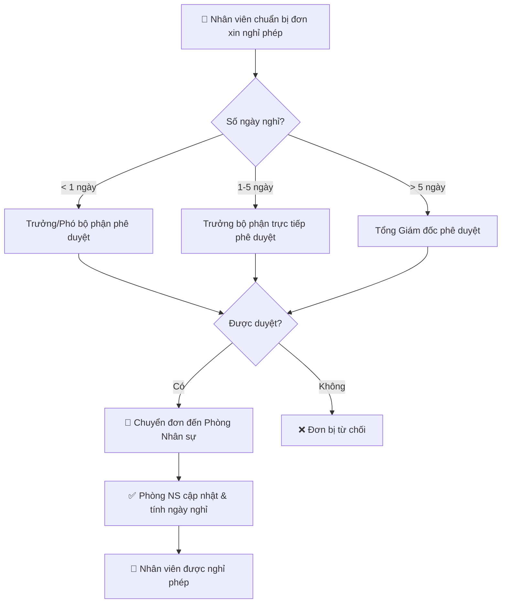

# 📋 Quy Trình Xin Nghỉ Phép Chuẩn

> **Nguồn:** [Tanca.io](https://tanca.io/blog/quy-trinh-xin-nghi-phep-chuan-ban-nen-luu-y)

---

## 1. Các loại nghỉ phép phổ biến trong công ty

| Loại nghỉ phép | Mô tả |
|---|---|
| **Nghỉ phép năm** | Ít nhất 12 ngày/năm theo quy định pháp luật |
| **Nghỉ phép bù** | Nghỉ bù khi làm ngoài giờ hoặc ngày nghỉ |
| **Nghỉ thai sản** | Theo quy định pháp luật cho lao động nữ |
| **Nghỉ kết hôn** | Theo chính sách công ty |
| **Nghỉ tang** | Khi có người thân qua đời, theo quy định pháp luật và công ty |
| **Nghỉ không lương** | Nghỉ dài hạn vì lý do cá nhân khi hết phép năm |
| **Nghỉ học tập/đào tạo** | Tham gia khóa học liên quan công việc |
| **Nghỉ bệnh** | Khi ốm đau hoặc tai nạn |

> [!IMPORTANT]
> Trong mọi trường hợp, nhân viên cần **nộp đơn xin nghỉ phép** và **thông báo cho quản lý trực tiếp** để được xem xét và phê duyệt.

---

## 2. Quy trình xin nghỉ phép tiêu chuẩn (3 bước)

### 📝 Bước 1: Chuẩn bị mẫu đơn Xin Nghỉ Phép

- Viết đơn xin nghỉ **theo mẫu của Phòng Nhân sự** (nếu công ty không có sẵn mẫu, có thể tải trên mạng).
- Thời gian xin phép trước tùy thuộc số ngày nghỉ:

| Số ngày nghỉ | Thời gian xin phép trước |
|---|---|
| Nửa ngày – 1 ngày | Trước **24 giờ** (ngày hôm trước) |
| 1,5 – 3 ngày | Trước **2 ngày** |
| 3,5 – 5 ngày | Trước **1 tuần** |
| Hơn 5 ngày | Trước **2 tuần** |

### ✅ Bước 2: Trình lên cấp trên phê duyệt

Tùy thuộc vào thời gian nghỉ phép, đơn sẽ được phê duyệt bởi cấp quản lý phù hợp:

| Số ngày nghỉ | Người phê duyệt |
|---|---|
| Dưới 1 ngày | Trưởng/Phó hoặc Trưởng bộ phận |
| 1 – 5 ngày | Trưởng bộ phận trực tiếp |
| Từ 5 ngày trở lên | **Tổng Giám đốc** trực tiếp duyệt |

> [!NOTE]
> Người phê duyệt sẽ xem xét: khối lượng công việc, thời gian làm việc/nghỉ ngơi của nhân viên, và nội quy/quy chế công ty.

### 📨 Bước 3: Chuyển đơn xin nghỉ phép đến Phòng Nhân sự

- Sau khi đơn được duyệt → **chuyển đơn đến Phòng Nhân sự**.
- Phòng Nhân sự sẽ cập nhật và tính thời gian nghỉ.

> [!WARNING]
> Nếu **không chuyển đơn cho Phòng Nhân sự**, đơn sẽ **KHÔNG được chấp nhận**, dù đã có chữ ký phê duyệt.

> [!TIP]
> Trường hợp **bất khả kháng** (tai nạn, tang lễ…): có thể nghỉ trước, gửi đơn sau. Tuy nhiên, phải **báo trước cho quản lý** để sắp xếp công việc.

---

## 3. Flowchart quy trình



---

## 4. Mẫu đơn xin nghỉ phép chuyên nghiệp

```
[Người gửi (tên, chức vụ, bộ phận)]
[Địa chỉ công ty]

[Tên người nhận (người quản lý trực tiếp hoặc giám đốc)]
[Chức danh người nhận]
[Địa chỉ công ty]

[Thành phố, ngày tháng năm]

                    ĐƠN XIN NGHỈ PHÉP

Kính gửi [tên người nhận],

Tôi tên là [tên đầy đủ], chức vụ [chức vụ] tại bộ phận [tên bộ phận] 
của công ty [tên công ty].

Tôi viết đơn này để xin nghỉ phép từ ngày [ngày bắt đầu] đến ngày 
[ngày kết thúc], tổng cộng [số ngày nghỉ] ngày.

Lý do: [trình bày lý do nghỉ phép]

Trong thời gian nghỉ phép, tôi đã bàn giao công việc cho đồng nghiệp 
[tên đồng nghiệp] để đảm bảo công việc không bị gián đoạn.

Tôi sẽ quay lại làm việc vào ngày [ngày trở lại] và cam kết hoàn thành 
tốt công việc được giao.

Rất mong [tên người nhận] xem xét và cho phép.

Trân trọng,
[Chữ ký]
[Tên người gửi]
```

---

## 5. Lưu ý quan trọng khi viết đơn xin nghỉ phép

### 🤝 Thái độ thân thiện và lịch sự
- Thể hiện thái độ chân thành, có trách nhiệm với công việc.
- Cấp trên sẽ đồng cảm và tin tưởng hơn.

### 📌 Lý do xin nghỉ hợp lý
- Phải đưa ra **lý do chính đáng** (nghỉ ốm, xin visa, công tác…).
- Dù nghỉ không lương, nếu lý do không thuyết phục → vẫn **bị từ chối**.

### 📄 Trình bày mẫu đơn rõ ràng
- Đơn xin nghỉ phải **chỉn chu, rõ ràng**, thể hiện sự chuyên nghiệp.
- Nếu nghỉ dài ngày → **phải có phương án bàn giao công việc** để đảm bảo tiến độ không bị đình trệ.

> [!CAUTION]
> Điều cấp trên quan tâm nhất: **sự vắng mặt của bạn có ảnh hưởng đến công việc của công ty hay không**. Hãy luôn chuẩn bị phương án bàn giao trước khi nộp đơn.
